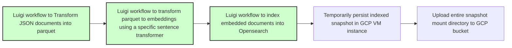
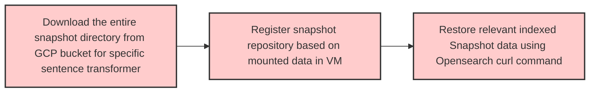

# DS@GT CLEF LongEval Snapshot Restoration Methodology
---

#### Snapshot Creation Flow


---

1. SSH into the GCP VM instance and clone the longeval-2025 repo
2. Before getting docker running, ensure you have the following environment variables set
```bash
OPENSEARCH_PASSWORD=
OPENSEARCH_SNAPSHOT_DIR=
OPENSEARCH_DATA_DIR=
# Below is optional if you want to leverage repository-gcs plugin
# https://forum.opensearch.org/t/plugin-repository-gcs-not-working-for-snapshots/11126
GOOGLE_APPLICATION_CREDENTIALS= 
```
3. Run the following commands to prep permissions / docker
```bash
sudo chmod -R 775 "$OPENSEARCH_DATA_DIR"
sudo chmod -R 777 "$OPENSEARCH_SNAPSHOT_DIR"
sudo chown -R 1000:1000 "$OPENSEARCH_DATA_DIR"
sudo chmod -R 777 ./data/longeval/opensearch-v1
sudo gpasswd -a $USER docker
newgrp docker
```
4. Ensure you are on your user gcloud account `gcloud auth list` otherwise switch your active account by running `gcloud auth login`

5. Create an IAM service account in GCP. It needs to have the `roles/storage.objectCreator` role. If this doesn't work you may need to grant it Storage Admin permissions

6. Run `docker compose up` and also ``curl -X GET "http://localhost:9200/_cluster/health?pretty"``. Ensure the value for path.repo looks correct as specified in the docker-compose file

7. After running the luigi worflows and creating the dat files in the `$OPENSEARCH_SNAPSHOT_DIR` directory, you can proceed with transferring them to the appropriate GCP bucket folder. You can run a command akin to `gsutil cp /home/ikafrulbasha/opensearch-snapshots/snap--OrUwZR6SceWJ1IcqkqV8Q.dat gs://dsgt-longeval-2025/opensearch-snapshots/`
---

#### Health Check Snapshot Creation

##### Create and view an document in open search

```json
curl -X POST "http://localhost:9200/my-index/_doc/1" -H 'Content-Type: application/json' -d'
{
  "title": "Sample Document",
  "author": "John Doe",
  "content": "This is a sample document inserted into OpenSearch.",
  "timestamp": "2025-02-11T00:00:00"
}'
```
```
curl -X GET "http://localhost:9200/my-index/_doc/1"
```

##### Create a snapshot repository

```json
 curl -X PUT "http://localhost:9200/_snapshot/dev-test-snapshot" -H 'Content-Type: application/json' -d'
{
  "type": "fs",
  "settings": {
    "location": "/mnt/snapshots"
  }
}'
```

##### Store the index you made in the new snapshot
```json
curl -X PUT "http://localhost:9200/_snapshot/dev-test-snapshot/first-snapshot" -H 'Content-Type: application/json' -d'
{
  "indices": "my-index",
  "ignore_unavailable": true,
  "include_global_state": false
}'
```

##### View snapshot list
```json
curl -X GET "http://localhost:9200/_snapshot/dev-test-snapshot/_all"
```


Some commands that may be helpful during debugging:
- `docker exec -it longeval-2025_opensearch_1 /bin/bash`
- `docker restart longeval-2025_opensearch_1`
- `docker logs longeval-2025_opensearch_1 --tail 100`
- `docker ps`
- `ls -ld *directory*`
- `ps aux | grep opensearch`
- `docker compose up -d`


#### Snapshot Restoration Flow



---
A proposed way to store the mount directories in the `dsgt-longeval-2025` bucket:

```
dsgt-longeval-2025
     │
     ├── all-MiniLM-L6-v2
     │        │
     │        │── index.latest
     │        │── indices/
     │        │   ├── index-1/
     │        │   │   ├── 0/  (Shard 0 data)
     │        │   │   ├── 1/  (Shard 1 data)
     │        │── meta-UUID1.dat  <-- Metadata for Snapshot-1
     │        │── meta-UUID2.dat  <-- Metadata for Snapshot-2
     │        │── snap-UUID1.dat  <-- Data file for Snapshot-1
     │        │── snap-UUID2.dat  <-- Data file for Snapshot-2
     │
     ├── joe32140/ModernBERT-base-msmarco
     │        │
     │        │── index.latest
     │        │── indices/
     │        │   ├── index-1/
     │        │   │   ├── 0/  (Shard 0 data)
     │        │   │   ├── 1/  (Shard 1 data)
     │        │── meta-UUID1.dat  <-- Metadata for Snapshot-1
     │        │── meta-UUID2.dat  <-- Metadata for Snapshot-2
     │        │── snap-UUID1.dat  <-- Data file for Snapshot-1
     │        │── snap-UUID2.dat  <-- Data file for Snapshot-2
     |
    ... 
```

---
Once your snapshot mount directory is stored locally in the VM instance (transferred from the appropriate GCP bucket folder) you may register the repository at the download loacation
```json
curl -X PUT "http://localhost:9200/_snapshot/dev-test-snapshot" -H 'Content-Type: application/json' -d'
{
  "type": "fs",
  "settings": {
    "location": "/mnt/snapshots"
  }
}'

```
You may restore a specific index like so
```json
curl -X POST "http://localhost:9200/_snapshot/dev-test-snapshot/my-snapshot/_restore" -H 'Content-Type: application/json' -d'
{
  "indices": "my-index", 
  "ignore_unavailable": true,
  "include_global_state": false
}'
```

To check the restoration status, you can run the command below.
```json
curl -X GET "http://localhost:9200/_cat/recovery?v"
```

After these steps, a user may proceed with running Opensearch experiments

